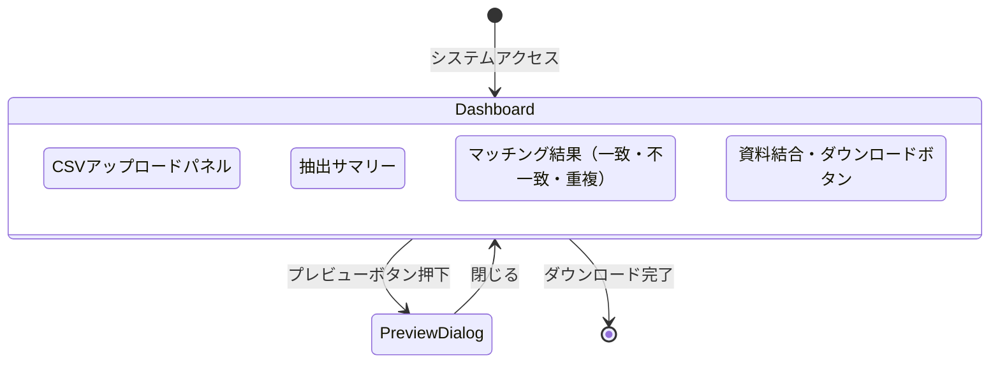

# 画面一覧＋画面遷移図

## 画面一覧
1. **メインダッシュボード (MainDashboard)** : CSVファイルのアップロードと全体状況の確認
2. **プレビューダイアログ (EstimatePreviewDialog)** : 抽出された見積もり・資料の詳細プレビュー表示

## 画面遷移図

```mermaid
stateDiagram-v2
    [*] --> Dashboard : システムアクセス
    
    state Dashboard {
        Upload : CSVアップロードパネル
        Summary : 抽出サマリー
        Tables : マッチング結果（一致・不一致・重複）
        Action : 資料結合・ダウンロードボタン
    }
    
    Dashboard --> PreviewDialog : プレビューボタン押下
    PreviewDialog --> Dashboard : 閉じる
    Dashboard --> [*] : ダウンロード完了
```
