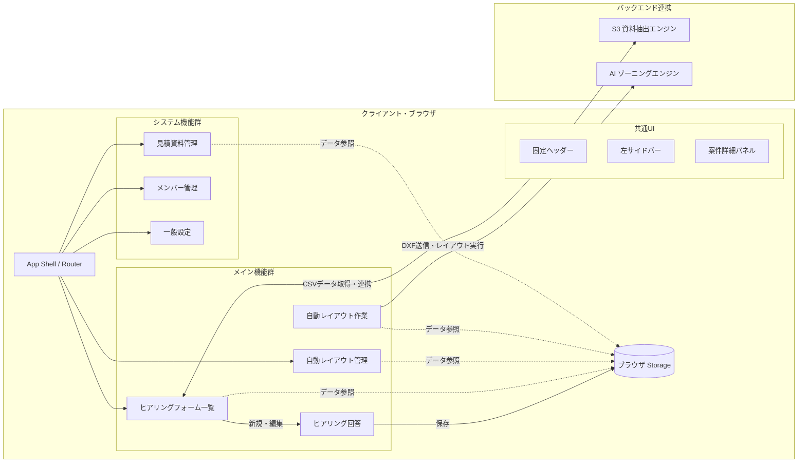

# システム構成図（アーキテクチャ）

本システムの主要コンポーネントとデータフローを示すアーキテクチャ構成図です。
提案DXフロントエンドプラットフォームとしてのモジュール構成を示します。

```mermaid
flowchart LR
    subgraph ClientApp [クライアント・ブラウザ]
        App[App Shell / Router]
        
        subgraph MainFeatures [メイン機能群]
            Home[ヒアリングフォーム一覧]
            Question[ヒアリング回答]
            AutoLayout[自動レイアウト管理]
            AutoLayoutWS[自動レイアウト作業]
        end

        subgraph SystemFeatures [システム機能群]
            Estimate[見積資料管理]
            Users[メンバー管理]
            Settings[一般設定]
        end
        
        subgraph CommonUI [共通UI]
            Header[固定ヘッダー]
            Sidebar[左サイドバー]
            RightPanel[案件詳細パネル]
        end
        
        LocalStorage[(ブラウザ Storage)]
    end

    subgraph BackendAPI [バックエンド連携]
        S3Extract[S3 資料抽出エンジン]
        AIDesigner[AI ゾーニングエンジン]
    end

    App --> Home
    App --> AutoLayout
    App --> Estimate
    App --> Users
    App --> Settings

    Home -->|新規・編集| Question
    Question -->|保存| LocalStorage
    Home -.->|データ参照| LocalStorage
    AutoLayout -.->|データ参照| LocalStorage
    AutoLayoutWS -.->|データ参照| LocalStorage
    Estimate -.->|データ参照| LocalStorage
    
    Home <-->|CSVデータ取得・連携| S3Extract
    AutoLayoutWS -->|DXF送信・レイアウト実行| AIDesigner
```
