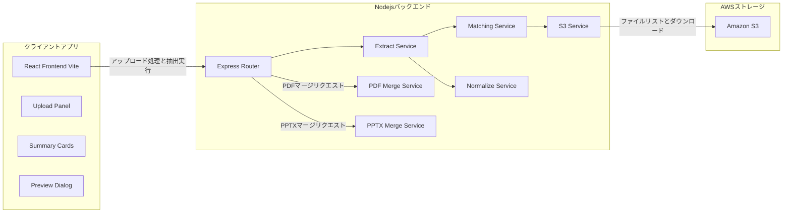

# システム構成図（アーキテクチャ）

本システムの主要コンポーネントとデータフローを示すアーキテクチャ構成図です。

```mermaid
flowchart LR
    subgraph clientApp [クライアントアプリ]
        UI[React Frontend Vite]
        UploadPanel[Upload Panel]
        Summary[Summary Cards]
        Preview[Preview Dialog]
    end

    subgraph serverApp [Nodejsバックエンド]
        API[Express Router]
        ExtractServ[Extract Service]
        MatchingServ[Matching Service]
        NormalizeServ[Normalize Service]
        pdfMerger[PDF Merge Service]
        pptxMerger[PPTX Merge Service]
        s3Serv[S3 Service]
    end

    subgraph storageApp [AWSストレージ]
        S3[Amazon S3]
    end

    UI -->|アップロード処理と抽出実行| API
    API --> ExtractServ
    ExtractServ --> NormalizeServ
    ExtractServ --> MatchingServ
    MatchingServ --> s3Serv
    s3Serv -->|ファイルリストとダウンロード| S3
    
    API -->|PDFマージリクエスト| pdfMerger
    API -->|PPTXマージリクエスト| pptxMerger
```
