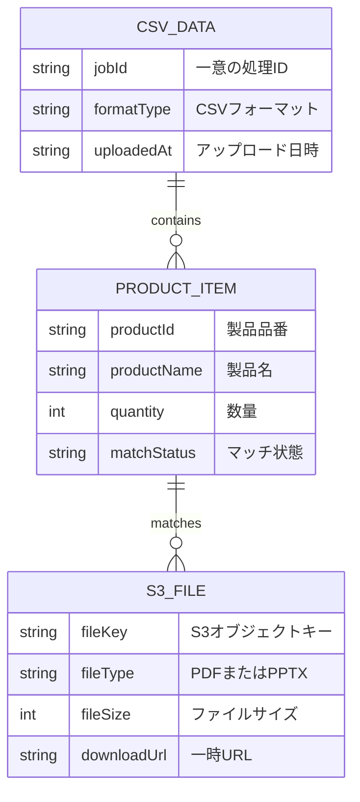

# データ設計（ER図・データモデル）

## エンティティ・リレーション設計

本システムはRDBMSを持たず、CSVのアップロードデータをメモリ上で処理・構造化する設計となっています。以下は内部データ構造（モデル）のER図相当のクラス構造です。

```mermaid
erDiagram
    CSV_DATA ||--o{ PRODUCT_ITEM : contains
    PRODUCT_ITEM ||--o{ S3_FILE : matches
    
    CSV_DATA {
        string jobId "一意の処理ID"
        string formatType "CSVフォーマット"
        string uploadedAt "アップロード日時"
    }
    
    PRODUCT_ITEM {
        string productId "製品品番"
        string productName "製品名"
        int quantity "数量"
        string matchStatus "マッチ状態"
    }
    
    S3_FILE {
        string fileKey "S3オブジェクトキー"
        string fileType "PDFまたはPPTX"
        int fileSize "ファイルサイズ"
        string downloadUrl "一時URL"
    }
```
