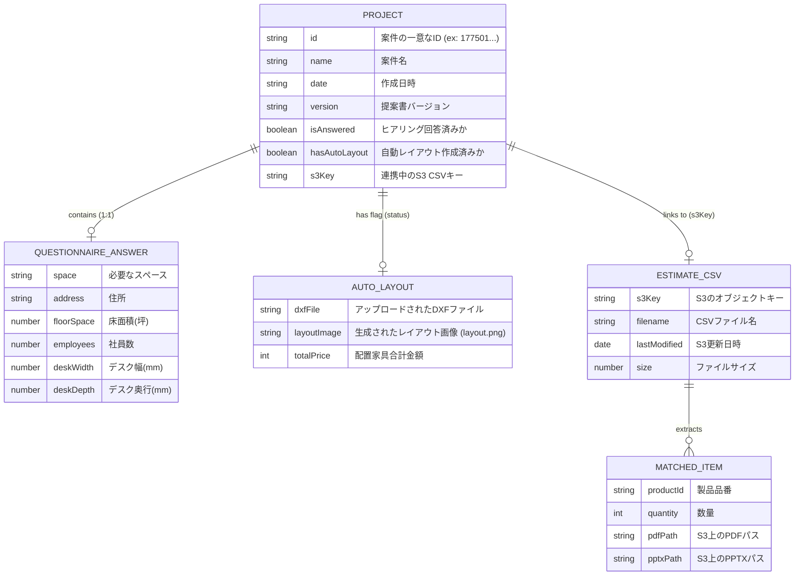

# データ設計（ER図・データモデル）

## エンティティ・リレーション設計

本システムはRDBMSを持たず、モック段階として `localStorage('teian_projects')` を中心に案件データを管理しています。
各案件がヒアリング回答、自動レイアウト状態、CSV連携状態を内包する設計です。

```mermaid
erDiagram
    PROJECT ||--o| QUESTIONNAIRE_ANSWER : "contains (1:1)"
    PROJECT ||--o| AUTO_LAYOUT : "has flag (status)"
    PROJECT ||--o| ESTIMATE_CSV : "links to (s3Key)"
    
    ESTIMATE_CSV ||--o{ MATCHED_ITEM : "extracts"

    PROJECT {
        string id "案件の一意なID (ex: 177501...)"
        string name "案件名"
        string date "作成日時"
        string version "提案書バージョン"
        boolean isAnswered "ヒアリング回答済みか"
        boolean hasAutoLayout "自動レイアウト作成済みか"
        string s3Key "連携中のS3 CSVキー"
    }

    QUESTIONNAIRE_ANSWER {
        string space "必要なスペース"
        string address "住所"
        number floorSpace "床面積(坪)"
        number employees "社員数"
        number deskWidth "デスク幅(mm)"
        number deskDepth "デスク奥行(mm)"
    }
    
    AUTO_LAYOUT {
        string dxfFile "アップロードされたDXFファイル"
        string layoutImage "生成されたレイアウト画像 (layout.png)"
        int totalPrice "配置家具合計金額"
    }

    ESTIMATE_CSV {
        string s3Key "S3のオブジェクトキー"
        string filename "CSVファイル名"
        date lastModified "S3更新日時"
        number size "ファイルサイズ"
    }
    
    MATCHED_ITEM {
        string productId "製品品番"
        int quantity "数量"
        string pdfPath "S3上のPDFパス"
        string pptxPath "S3上のPPTXパス"
    }
```
