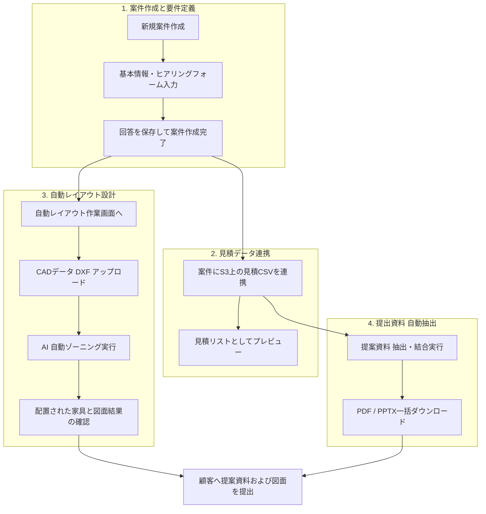
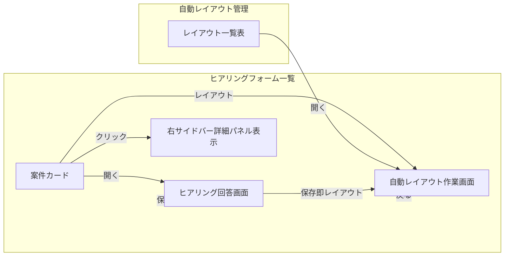

# 業務フロー図（全体プロセスマップ）

## 1. 提案DXプラットフォーム 全体ワークフロー

本システムにおける、「ヒアリング〜自動レイアウト〜資料抽出」までの一連のユーザー体験のフローを示します。

```mermaid
flowchart TD
    subgraph createProject [1. 案件作成と要件定義]
        Start[新規案件作成] --> InputInfo[基本情報・ヒアリングフォーム入力]
        InputInfo --> SaveQA[回答を保存して案件作成完了]
    end

    subgraph assignEstimate [2. 見積データ連携]
        SaveQA --> LinkCSV[案件にS3上の見積CSVを連携]
        LinkCSV --> Preview[見積リストとしてプレビュー]
    end

    subgraph runLayout [3. 自動レイアウト設計]
        SaveQA --> AutoLayout[自動レイアウト作業画面へ]
        AutoLayout --> UploadDXF[CADデータ DXF アップロード]
        UploadDXF --> RunZoning[AI 自動ゾーニング実行]
        RunZoning --> CheckResult[配置された家具と図面結果の確認]
    end

    subgraph extractDocs [4. 提出資料 自動抽出]
        LinkCSV --> ExtractStart[提案資料 抽出・結合実行]
        ExtractStart --> MergePDF[PDF / PPTX一括ダウンロード]
    end
    
    CheckResult --> End[顧客へ提案資料および図面を提出]
    MergePDF --> End
```

## 2. 画面遷移フロー

各種画面のアクションからの遷移関係です。

```mermaid
flowchart LR
    subgraph Dashboard [ヒアリングフォーム一覧]
        Card[案件カード] -->|開く| Questionnaire[ヒアリング回答画面]
        Card -->|レイアウト| AutoLayoutWorkspace[自動レイアウト作業画面]
        Card -->|クリック| Details[右サイドバー詳細パネル表示]
    end

    subgraph AutoLayoutList [自動レイアウト管理]
        List[レイアウト一覧表] -->|開く| AutoLayoutWorkspace
    end

    Questionnaire -->|保存| Dashboard
    Questionnaire -->|保存即レイアウト| AutoLayoutWorkspace
    
    AutoLayoutWorkspace -->|戻る| Dashboard
```
