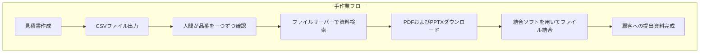
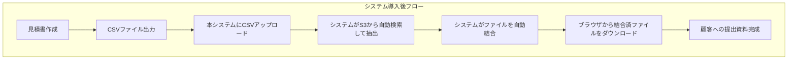

# 業務フロー図（As-Is / To-Be）

## 1. As-Is 業務フロー（現状）
手作業で一つ一つの資料を検索し結合する。

```mermaid
flowchart TD
    subgraph asIsFlow [手作業フロー]
        start1[見積書作成] --> step2[CSVファイル出力]
        step2 --> step3[人間が品番を一つずつ確認]
        step3 --> step4[ファイルサーバーで資料検索]
        step4 --> step5[PDFおよびPPTXダウンロード]
        step5 --> step6[結合ソフトを用いてファイル結合]
        step6 --> end1[顧客への提出資料完成]
    end
```

## 2. To-Be 業務フロー（導入後）
本システムによって検索から結合までが自動化される。

```mermaid
flowchart TD
    subgraph toBeFlow [システム導入後フロー]
        start2[見積書作成] --> tstep2[CSVファイル出力]
        tstep2 --> tstep3[本システムにCSVアップロード]
        tstep3 --> tstep4[システムがS3から自動検索して抽出]
        tstep4 --> tstep5[システムがファイルを自動結合]
        tstep5 --> tstep6[ブラウザから結合済ファイルをダウンロード]
        tstep6 --> end2[顧客への提出資料完成]
    end
```
